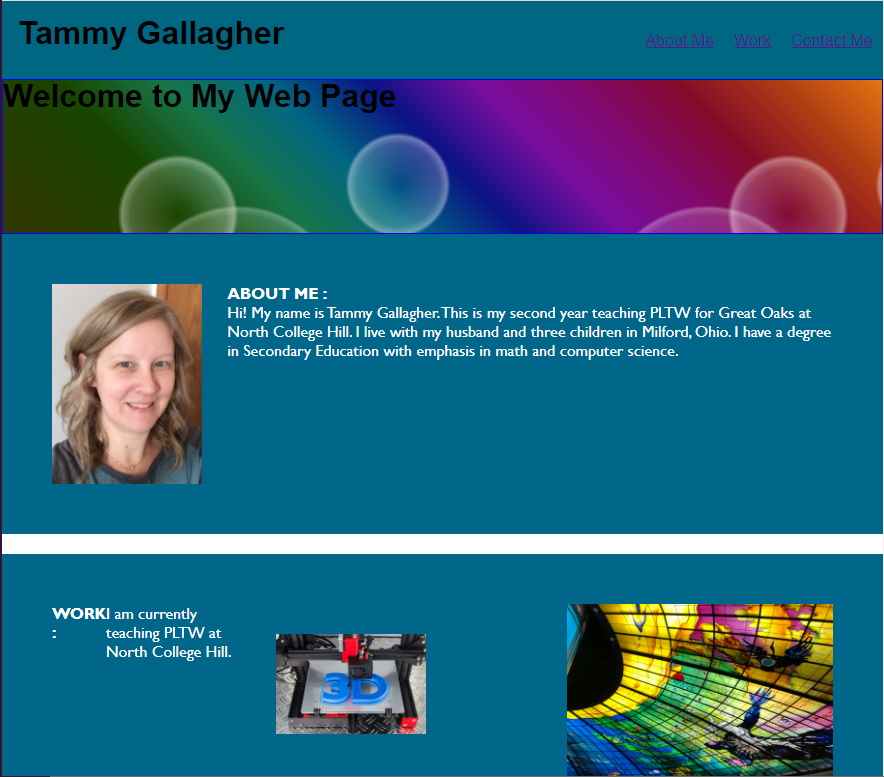

# Challenge2CssPortfolio

## Description

This Project  is the starting point for the class portfolio.  This project helped us learn about html and css.  

## Usage

Provide instructions and examples for use. Include screenshots as needed.

To add a screenshot, create an `assets/images` folder in your repository and upload your screenshot to it. Then, using the relative filepath, add it to your README using the following syntax:

    

## Credits

I have included images from Project Lead the Way and Vex.  
